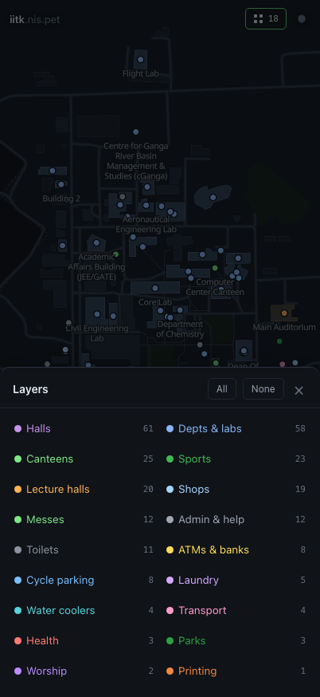

# iitk.nis.pet

A map of IIT Kanpur with the things students actually look for — lecture halls,
messes, water coolers, cycle stands, ATMs, laundry, printing, step-free access,
opening hours — and one fast search over all of it.

**[iitk.nis.pet](https://iitk.nis.pet)**


<table>
<tr>
<td width="50%"></td>
<td width="50%"></td>
</tr>
<tr>
<td align="center"><sub><code>mess dinner</code> — every hall's dinner, from the live feed</sub></td>
<td align="center"><sub>Light theme, follows your system by default</sub></td>
</tr>
</table>

<p align="center">
  
  
  <br><sub>Mobile: search in thumb reach, layers behind a toggle rather than strewn over the map</sub>
</p>

```
⌘K            open the palette
L20           Lecture Hall 20
mess dinner   what every hall is serving tonight
water         nearest coolers
kd            H.R. Kadim Diwan Building
tab           route to the highlighted result
```

## The one rule

**Real data or no data.** Every fact in this repo traces to a public source.
Where no source exists the feature is simply absent, and the palette says so
instead of guessing. There is no placeholder timetable, no invented professor,
no plausible-looking bus schedule. See [TODO.md](TODO.md) for what is missing
and what each gap needs.

## Sources

| What | Where from | Count |
|---|---|---|
| Places, geometry, opening hours, wheelchair tags | [OpenStreetMap](https://www.openstreetmap.org/relation/52434888) (ODbL) | 276 places, 20 lecture halls |
| Walking & cycling network | OpenStreetMap paths, footways, corridors, steps | 1145 nodes / 1294 edges |
| Faculty directory | [iitk.ac.in/iitk-faculty](https://www.iitk.ac.in/iitk-faculty) + profile pages | 663 people, 445 placed on the map |
| Mess menus | [campusmess.in](https://campusmess.in) public API | 189 menus, 14 halls |

That listing renders 12 people per department and hides the rest behind a Load
More button, which POSTs to `/loadmore-faculty?count=N&taxon=T`. The fetcher
walks that endpoint across the 21 paged departments — of 27 total; the other six
fit on one page — so this is everything the directory publishes. Whether that
equals every person employed as faculty is IIT Kanpur's business, not something
this repo can verify.

663 people across 739 department slots: 59 hold joint appointments and are
stored once, carrying all of their departments. Smoke tests fail the build if
the count falls below 600, if any department comes back short, or if one person
lands in the index twice.

## Running it

```bash
npm install
npm run fetch      # OpenStreetMap via Overpass — cached, use --force to refetch
node scripts/fetch-web.mjs   # faculty + mess menus
npm run dev
```

`data/raw` and `data/live` are committed, so `npm run dev` works straight after
`npm install` without touching the network.

```bash
npm test           # typecheck + rebuild data + smoke test
npm run verify     # load it in a real headless Chrome and assert it works
```

`npm run verify` drives a throwaway Chrome profile against a running dev server
and fails on any console error, failed request, missing map label or overlapping
UI. Unit tests cannot catch "the page loads but the map never appears"; that can,
and it runs in CI on every push.

## How it works

**No tile server, no external request.** The basemap is drawn from our own
GeoJSON extract — buildings, paths, greens, water — so there is no API key and
no tile budget. Label glyphs are served from `public/font` too: pointing them at
a demo CDN cost every label on the map the day that host 404'd the fontstack.

**Routing.** A\* over the OSM path network. Edge costs are baked per profile at
build time in *seconds*, so the ETA is the final g-score rather than a
distance-divided-by-guess. Steps and indoor corridors are passable by bike at
pushing speed — modelling them as forbidden strands any building entered through
a corridor. Only the largest connected component ships; stray stubs would make
routing fail in ways that read as bugs.

**Search.** Everything is indexed into one flat document list at load — places,
people, mess menus, layers, commands. Ranking is exact-key, then prefix, then a
subsequence match with contiguity and word-boundary bonuses, then all-words-present,
then substring. `mess dinner` is intercepted before generic ranking so it answers
with tonight's food rather than a list of halls. Typical query: **under 0.3 ms**
over 971 documents.

**Opening hours** are parsed by a deliberately partial `opening_hours` reader
that returns `null` for anything it does not understand. A wrong "open now" is
worse than none.

## Layout

```
data/raw/        OpenStreetMap dumps (committed)
data/live/       faculty + mess snapshots (committed, refreshed weekly by CI)
data/curated/    hand-surveyed places — empty by default, anchored to OSM features
scripts/
  fetch-osm.mjs    Overpass, retries across mirrors
  fetch-web.mjs    faculty directory + campusmess
  build-data.mjs   normalise -> public/data/{campus,geo,graph}.json
  smoke.mjs        search, routing and map-style assertions
src/
  map/style.ts     MapLibre style built from our GeoJSON
  route/router.ts  A* with a CSR adjacency and a binary heap
  search/engine.ts index, scoring, intents
  ui/              palette + detail panel
```

## Contributing

Most of the physical world — printers, water coolers, cycle stands, opening
hours, step-free access — belongs in **OpenStreetMap** rather than here. Map it
once there and this picks it up on the next `npm run fetch`, along with every
other OSM consumer. For contributing to OSM, please refer to: [OpenStreetMap Web - IIT Kanpur](https://www.openstreetmap.org/#map=15/26.51317/80.22539).

For anything OSM will not take, add it to `data/curated/places.json` — either
with surveyed `lat`/`lon`, or with an `anchor` naming a real OSM feature to sit
beside, in which case the build resolves the position and warns if that anchor
stops matching. Coordinates must come from an actual survey; nothing invented.

For code changes/features/suggustions, feel free to make an issue or a pull request in this repo - if I somehow miss it, please do not
hesitate to tag me in the issue/PR thread. 

## Pixels

> **Not live.** The pixel canvas is experimental and in development. It is off
> in production: there is no link from the map, `/pixels` serves a short notice
> saying so, and the API answers 404. The code is all here and unchanged.
>
> One switch controls it — `PIXELS_ENABLED` in
> [`shared/pixels-flag.ts`](shared/pixels-flag.ts). A `PIXELS_ENABLED` variable
> on the Pages project (`"0"` / `"1"`) overrides the constant at runtime, so it
> can be flipped from the dashboard without a deploy. `PIXELS=1 npm run dev`
> runs the real thing locally.

`/pixels` is a shared canvas laid over the campus: a fixed grid at **2 m per
pixel**, 1495 × 1503 cells, painted by anyone who turns up. Seeded with pride
flags and a few chibi characters anchored to real buildings.

Open to everyone — no login. Abuse is handled by **rate limiting per IP**:
30 pixels, then a 60-second cooldown, and at most 12 pixels per request.

### Campus IP whitelist

Requests from IIT Kanpur get a much larger budget — **500 pixels a minute** by
default instead of 30. Ranges and budget are editable live from **Campus IPs**
in the admin panel; the values below are only the fallback when nothing is
stored.

| Range | |
|---|---|
| `202.3.77.0/24` | campus network (legacy/primary) |
| `103.246.106.0/24` | IIT Kanpur |
| `161.248.106.0/24` | IIT Kanpur |
| `2001:df0:92::/48` | campus network, IPv6 |

Only globally routable ranges are listed, and that is deliberate. Cloudflare
reports the *public* source address in `cf-connecting-ip`, so a private range —
`172.24/16`, `172.31.0.0/17`, `10/8` — can never appear there however much of
campus sits behind it; those hosts reach us NATed out through the blocks above.
Adding them would be config that quietly matches nothing. `172.16/12` is shared
address space and emphatically not all IITK, so it is not whitelisted either.

Matching is a real bit-prefix comparison over both families, with IPv4-mapped
IPv6 (`::ffff:202.3.77.5`) folded down so it still matches the v4 rule. The
smoke suite pins the behaviour in both directions — inside the range and just
outside it — because a whitelist that is too wide hands 500/min to the open
internet, and one that is too narrow throttles campus to 30.

The client is not trusted. Position, colour index and budget are all re-checked
server-side, so a crafted request cannot paint outside the grid, invent a
colour, or skip the cooldown.

### Setup on Cloudflare Pages

| Binding | Type | Purpose |
|---|---|---|
| `DB` | D1 database | canvas, rate limits, bans, log buffer |
| `DISCORD_WEBHOOK` | secret | pixel log; server-side only, never sent to the browser |
| `PIXELS_ADMIN_TOKEN` | secret | bearer token for the admin route |

**Not KV.** KV bills per operation and its free tier allows 1,000 writes a day.
One paint request cost five of them — rate-limit counter, canvas chunk, Discord
buffer, attribution record, live feed — so the canvas ran dry after about 200
requests, and live polling alone would exhaust the read quota in ~35 tab-hours.
D1 bills per row, allows 100,000 row-writes a day, and suits the data better:
one row per pixel, a monotonic `seq` driving the live feed, and the painter
recorded on the row instead of in a side list.

Without the KV binding the page renders the seeded art **read-only** and the
status bar says so — a missing binding degrades rather than breaks. That is
also what `vite preview` shows locally, since it does not run Functions.

Creating the namespace is the one step that cannot be done from this repo:

```bash
npx wrangler d1 create iitk-pixels     # prints a database id
```

Then in the dashboard: **your Pages project → Settings → Bindings → Add →
D1 database**, pointing at that database, on **both** Production and Preview.

Name the variable `DB`. `iitk_pixels` — the name `wrangler d1 create` suggests
— is accepted too, so a copy-pasted binding does not silently 503.

`/api/pixels` returns `503 canvas storage is not configured` until one of those
is bound.

Tables are created on first request, so there is no migration step.

### Identity and logging

We never store or log an IP address. Rate limits, bans and the Discord log all
key off a 10-character hash of it — enough to moderate with, useless for
identifying anyone off-platform.

Pixels are logged in batches of 25 rather than one message each: a Discord
webhook is limited to a handful of posts per second, and per-pixel messages
would be throttled into uselessness the moment two people drew at once.

### Moderation

```bash
T=your-admin-token
A=https://iitk.nis.pet/api/pixels/admin
post() { curl -s -X POST "$A" -H "authorization: Bearer $T" -H 'content-type: application/json' -d "$1"; }

post '{"op":"stats"}'                                    # counts
post '{"op":"clearRect","x":700,"y":800,"w":40,"h":40}'  # erase a region
post '{"op":"fillRect","x":700,"y":800,"w":40,"h":40,"c":5}'
post '{"op":"paint","pixels":[[700,800,8],[701,800,8]]}' # stamp art over it
post '{"op":"clearAll"}'                                 # wipe user pixels
post '{"op":"iprules"}'                                  # read the campus whitelist
post '{"op":"setIprules","rules":{"enabled":true,"burst":500,"cooldown":60,
  "cidrs":["202.3.77.0/24","2001:df0:92::/48"]}}'        # replace it
post '{"op":"bans"}'                                     # list
post '{"op":"ban","id":"a1b2c3d4e5"}'                    # id comes from the log
post '{"op":"unban","id":"a1b2c3d4e5"}'
```

### Backing up the canvas

```bash
node scripts/pixels-backup.mjs dump
PIXELS_ADMIN_TOKEN=… node scripts/pixels-backup.mjs restore data/backups/pixels-<stamp>.json --yes
```

`dump` writes every user-painted pixel to `data/backups/` as flat `[x, y, c]`
triples with the sequence number it was taken at. The seeded art is deliberately
absent: it is a static file baked at build time, `clearAll` never touches it, and
including it would double the file for nothing.

`restore` stamps the pixels back through the admin `paint` op, which bypasses
rate limits. It refuses without `--yes` and prints the row count first — D1 bills
per row and the free tier allows 100,000 writes a day, so a large canvas will not
restore in a single day.

`clearAll` only removes user-drawn pixels. The seed is a static file, not
storage, so the canvas is never left blank.

### Editing the seed

Sprites live in `scripts/build-pixels.mjs` as rows of characters, one per
colour, and are validated for a clean rectangle at build time. `npm run
build:data` re-bakes `public/data/pixels-seed.json`.

**Known limit:** KV is eventually consistent and has no transactions, so two
people painting the same 128 × 128 chunk within the same second can lose one
write. Acceptable for a campus toy; a Durable Object per chunk is the fix if it
ever gets busy.

## Deploying

Cloudflare Pages, building from the Git integration:

- Build command `npm run build`
- Output directory `dist`
- Node version from `.nvmrc` (22)
- `functions/` is picked up automatically as Pages Functions — see Pixels above
  for the bindings it needs

`.github/workflows/ci.yml` typechecks, smoke-tests and builds every push and PR.
`.github/workflows/refresh-data.yml` re-pulls all sources weekly and opens a PR
if anything changed — a PR rather than a push, so a source going weird never
lands silently on the live site.

## Licence

Code [MIT](LICENSE). Map data © OpenStreetMap contributors,
[ODbL](https://www.openstreetmap.org/copyright). Faculty and mess snapshots
belong to their publishers and are mirrored here for a student tool, not
relicensed. Label glyphs derive from Noto Sans (OFL 1.1).
