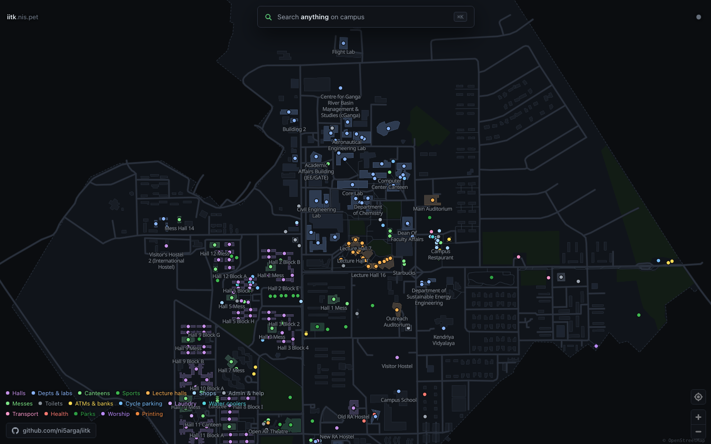
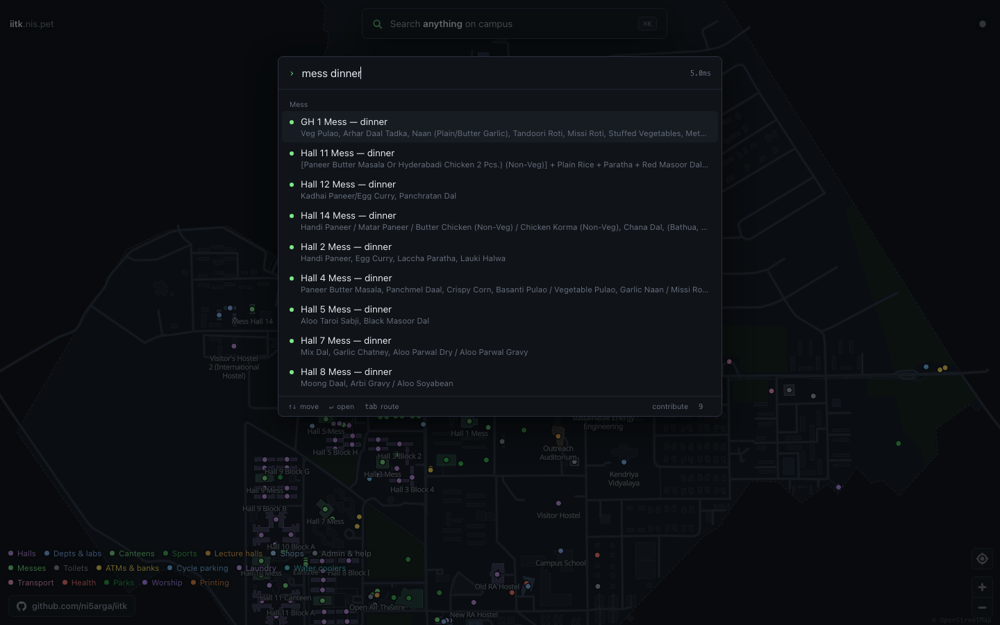
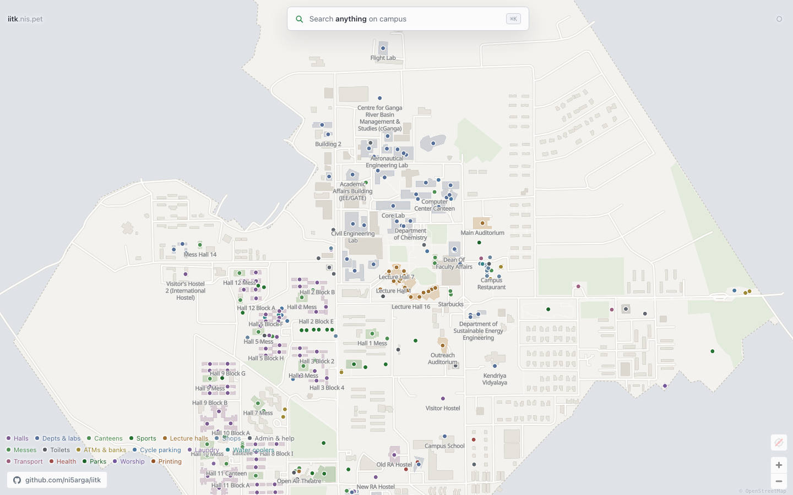
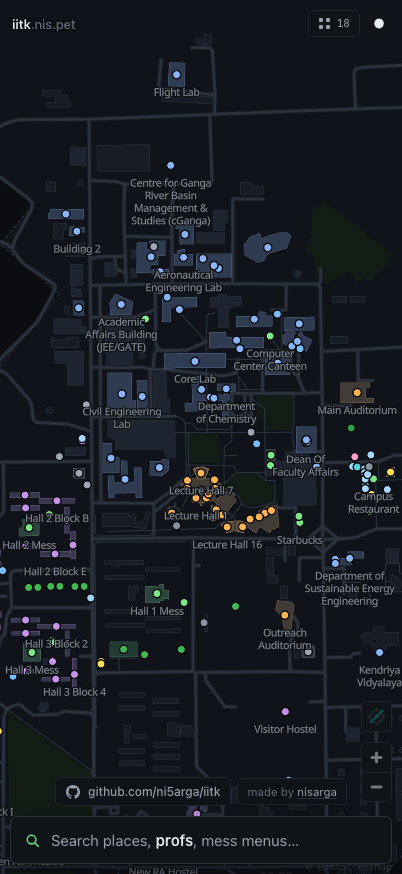

# iitk.nis.pet

A map of IIT Kanpur with the things students actually look for — lecture halls,
messes, water coolers, cycle stands, ATMs, laundry, printing, step-free access,
opening hours — and one fast search over all of it.

**[iitk.nis.pet](https://iitk.nis.pet)**



<table>
<tr>
<td width="50%"></td>
<td width="50%"></td>
</tr>
<tr>
<td align="center"><sub><code>mess dinner</code> — every hall's dinner, from the live feed</sub></td>
<td align="center"><sub>Light theme, follows your system by default</sub></td>
</tr>
</table>

<p align="center">
  
  <br><sub>Mobile: search in thumb reach, results as a bottom sheet</sub>
</p>

```
⌘K            open the palette
L20           Lecture Hall 20
mess dinner   what every hall is serving tonight
water         nearest coolers
kd            H.R. Kadim Diwan Building
tab           route to the highlighted result
```

## The one rule

**Real data or no data.** Every fact in this repo traces to a public source.
Where no source exists the feature is simply absent, and the palette says so
instead of guessing. There is no placeholder timetable, no invented professor,
no plausible-looking bus schedule. See [TODO.md](TODO.md) for what is missing
and what each gap needs.

## Sources

| What | Where from | Count |
|---|---|---|
| Places, geometry, opening hours, wheelchair tags | [OpenStreetMap](https://www.openstreetmap.org/relation/52434888) (ODbL) | 276 places, 20 lecture halls |
| Walking & cycling network | OpenStreetMap paths, footways, corridors, steps | 1145 nodes / 1294 edges |
| Faculty directory | [iitk.ac.in/iitk-faculty](https://www.iitk.ac.in/iitk-faculty) + profile pages | 663 people, 445 placed on the map |
| Mess menus | [campusmess.in](https://campusmess.in) public API | 189 menus, 14 halls |

That listing renders 12 people per department and hides the rest behind a Load
More button, which POSTs to `/loadmore-faculty?count=N&taxon=T`. The fetcher
walks that endpoint across the 21 paged departments — of 27 total; the other six
fit on one page — so this is everything the directory publishes. Whether that
equals every person employed as faculty is IIT Kanpur's business, not something
this repo can verify.

663 people across 739 department slots: 59 hold joint appointments and are
stored once, carrying all of their departments. Smoke tests fail the build if
the count falls below 600, if any department comes back short, or if one person
lands in the index twice.

Deliberately **not** used: `iitk.ac.in/counsel/family_tree/data.json`. It is a
mentor/mentee tree of named students with roll numbers from the 2008–09 batches.
It contains no faculty, so it does not answer "prof \<name\>", and turning a
stale list of individuals into a searchable directory goes further than the page
that publishes it.

## Running it

```bash
npm install
npm run fetch      # OpenStreetMap via Overpass — cached, use --force to refetch
node scripts/fetch-web.mjs   # faculty + mess menus
npm run dev
```

`data/raw` and `data/live` are committed, so `npm run dev` works straight after
`npm install` without touching the network.

```bash
npm test           # typecheck + rebuild data + smoke test
npm run verify     # load it in a real headless Chrome and assert it works
```

`npm run verify` drives a throwaway Chrome profile against a running dev server
and fails on any console error, failed request, missing map label or overlapping
UI. Unit tests cannot catch "the page loads but the map never appears"; that can,
and it runs in CI on every push.

## How it works

**No tile server, no external request.** The basemap is drawn from our own
GeoJSON extract — buildings, paths, greens, water — so there is no API key and
no tile budget. Label glyphs are served from `public/font` too: pointing them at
a demo CDN cost every label on the map the day that host 404'd the fontstack.

**Routing.** A\* over the OSM path network. Edge costs are baked per profile at
build time in *seconds*, so the ETA is the final g-score rather than a
distance-divided-by-guess. Steps and indoor corridors are passable by bike at
pushing speed — modelling them as forbidden strands any building entered through
a corridor. Only the largest connected component ships; stray stubs would make
routing fail in ways that read as bugs.

**Search.** Everything is indexed into one flat document list at load — places,
people, mess menus, layers, commands. Ranking is exact-key, then prefix, then a
subsequence match with contiguity and word-boundary bonuses, then all-words-present,
then substring. `mess dinner` is intercepted before generic ranking so it answers
with tonight's food rather than a list of halls. Typical query: **under 0.3 ms**
over 971 documents.

**Opening hours** are parsed by a deliberately partial `opening_hours` reader
that returns `null` for anything it does not understand. A wrong "open now" is
worse than none.

## Layout

```
data/raw/        OpenStreetMap dumps (committed)
data/live/       faculty + mess snapshots (committed, refreshed weekly by CI)
data/curated/    hand-surveyed places — empty by default, anchored to OSM features
scripts/
  fetch-osm.mjs    Overpass, retries across mirrors
  fetch-web.mjs    faculty directory + campusmess
  build-data.mjs   normalise -> public/data/{campus,geo,graph}.json
  smoke.mjs        search, routing and map-style assertions
src/
  map/style.ts     MapLibre style built from our GeoJSON
  route/router.ts  A* with a CSR adjacency and a binary heap
  search/engine.ts index, scoring, intents
  ui/              palette + detail panel
```

## Contributing

Most of the physical world — printers, water coolers, cycle stands, opening
hours, step-free access — belongs in **OpenStreetMap** rather than here. Map it
once there and this picks it up on the next `npm run fetch`, along with every
other OSM consumer.

For anything OSM will not take, add it to `data/curated/places.json` with an
`anchor` naming a real OSM feature — never raw coordinates. The build resolves
the position and warns if the anchor stops matching.

Pull requests: [github.com/ni5arga/iitk](https://github.com/ni5arga/iitk)

## Deploying

Cloudflare Pages, building from the Git integration:

- Build command `npm run build`
- Output directory `dist`
- Node version from `.nvmrc` (22)

`.github/workflows/ci.yml` typechecks, smoke-tests and builds every push and PR.
`.github/workflows/refresh-data.yml` re-pulls all sources weekly and opens a PR
if anything changed — a PR rather than a push, so a source going weird never
lands silently on the live site.

## Licence

Code [MIT](LICENSE). Map data © OpenStreetMap contributors,
[ODbL](https://www.openstreetmap.org/copyright). Faculty and mess snapshots
belong to their publishers and are mirrored here for a student tool, not
relicensed. Label glyphs derive from Noto Sans (OFL 1.1).
